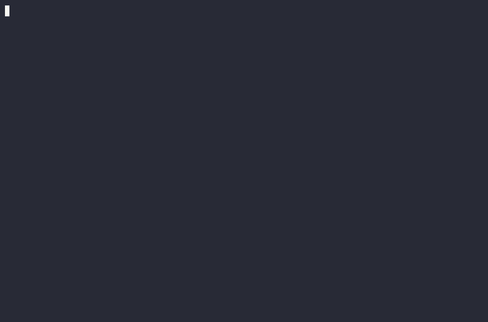
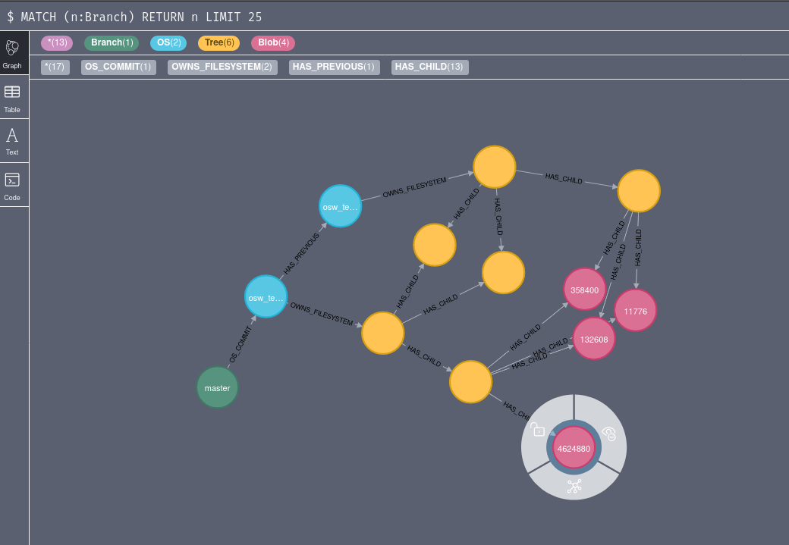

# neogit

[](https://pypi.org/project/neogit/)
[](https://pypi.org/project/neogit/)
[](https://github.com/OSWatcher/neogit/actions/workflows/ci.yml)
[](https://oswatcher.github.io/neogit/)
[](LICENSE)

> A Git-like tool for filesystems, backed by a Neo4j graph and pluggable object storage.

Neogit takes content-addressed Merkle-tree snapshots of a directory tree and stores them in two places:

- **Neo4j** stores the graph: commits, branches, trees, blobs, and their relationships
- **Object storage** holds the bytes: file contents addressed by their SHA-1 (local filesystem, MinIO, or S3 via [Apache Libcloud](https://libcloud.apache.org/))

This split makes filesystem state **queryable as a graph** (Cypher over commits, diff trees, walk history) while keeping file contents in cheap blob storage.

## Why neogit?

Git already content-addresses snapshots and deduplicates them, but it only lets you *walk* that history, never *query* it. The object graph is navigable only forward: a commit points to its files, never the reverse. neogit puts the same objects in a Neo4j graph, so history becomes something you can **query** and, crucially, **enrich**. Hang your own hashable characteristics (symbols, structs, registry values, syscalls) off the graph and ask questions across *all* of history:

- **Evolution**: how a file or characteristic changed across snapshots over time.
- **Provenance**: given one characteristic, *every* commit that ever contained it.
- **Commonality**: corpus-wide aggregates, like the most common or most stable characteristics across an OS's entire history.

The last two are where Git can't follow: its object graph is forward-only, so *"which commits contain object X?"* has no native answer, whereas in a graph it's a single traversal. See **[Why neogit?](docs/explanation/why-neogit.md)** for the details.

## Demo

Snapshotting two real Debian container filesystems (bullseye → bookworm): hashing and uploading ~5,700 files with live progress, then a full file-level diff of the upgrade:



…and the resulting Merkle graph in the Neo4j Browser:



## Where it's used

- **CLI tool**: capture and diff filesystem snapshots from the command line
- **Python library**: neogit captures the filesystem; your pipeline enriches the graph. Embed it to hang your own content-addressed sub-Merkle-trees off a `Blob` (anything you can hash) so your analysis dedups and diffs for free, exactly like the file bytes do. [OSWatcher](https://oswatcher.github.io/frontend/), for example, attaches extracted symbols, parsed structs, and Windows registry hives to neogit's `Commit` graph

## Quickstart

Requirements: Python 3.10+, Docker, and Git. Neogit uses local object storage by
default, so the minimal setup only needs Neo4j.

```bash
pipx install neogit
# or: python -m pip install neogit

# Start a local Neo4j database for the demo. Auth disabled is for local testing only.
docker run --rm --name neogit-neo4j \
  -p 7474:7474 -p 7687:7687 \
  -e NEO4J_AUTH=none \
  neo4j:5.26
```

In another terminal, snapshot a real project checkout:

```bash
git clone --depth 1 https://github.com/psf/requests.git neogit-demo-root

neogit init
neogit commit first-snapshot -r ./neogit-demo-root
```

Open the Neo4j browser at <http://localhost:7474> and run:

```cypher
MATCH (c:Commit)-[r]->(t:Tree) RETURN c, r, t LIMIT 25
```

## CLI overview

```bash
neogit init                                    # initialize database constraints
neogit commit <name> -r <path>                 # snapshot a directory on the default branch
neogit diff <old_hash> <new_hash>              # compare two filesystem snapshots
neogit branch <name> <commit_hash>             # create a branch pointing at a commit hash
```

See [docs/reference/cli.md](docs/reference/cli.md) for the full reference.

## Use as a library

```python
from pathlib import Path
from neogit.service import Neogit

git = Neogit()
git.init()
commit_hash = git.commit("snapshot-1", Path("/path/to/capture"))
```

The graph model (`Commit`, `Branch`, `Tree`, `Blob`, `PluginRun`) is exposed under `neogit.model` for downstream tools that want to attach their own nodes; see [docs/reference/data-model.md](docs/reference/data-model.md).

## Documentation

Full documentation lives under [`docs/`](docs/) and follows the [Divio framework](https://documentation.divio.com/):

- **[Tutorial](docs/tutorial/first-snapshot.md)**: your first snapshot in 5 minutes
- **[How-to guides](docs/how-to/)**: recipes for specific tasks (MinIO, S3, diffs, embedding the library)
- **[Reference](docs/reference/)**: CLI flags, config keys, data model
- **[Explanation](docs/explanation/)**: design rationale, Merkle layout, why Neo4j

To preview the docs locally:

```bash
poetry install --with docs       # one-time, installs mkdocs into the venv
poetry run poe docs_serve        # equivalent to: poetry run mkdocs serve
```

## Development

```bash
poetry install
poetry run poe ccode      # fmt + lint + type-check
poetry run poe test       # full test suite
```

See [docs/how-to/contributing.md](docs/how-to/contributing.md) for the full dev workflow.

## License

Licensed under the [Apache License 2.0](LICENSE). You're free to use, modify, and distribute neogit, including commercially, provided you preserve the copyright and license notices (see [NOTICE](NOTICE)).
